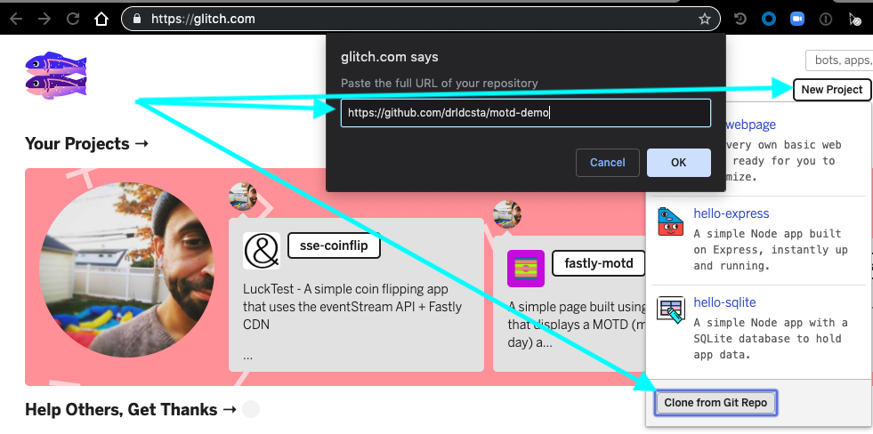

# Fastly Demo Setup (Generic)

## Introduction
The goal of this doc is to provide a high level overview of how to setup a Fastly demo. This will walk you through setting up Glitch, setting up Terraform, and using the two to jumpstart a demo. 

In order to follow this guide you will need a Fastly account (that you can create API tokens with), a [Glitch.com](https://glitch.com/) account, and [Brew](https://brew.sh/) (to install Terraform with). 

## Importing a demo into Glitch. 
For this demo we are giong to use the [Fastly-MoTD](https://github.com/drldcsta/motd-demo) demo hosted on Glitch. To do this you need to go to Glitch.com, click the `New Project` button in the upper right hand corner, select `Clone From Github` and paste in the Fastly-MoTD demo github URL. See screenshot:

It'll take a few seconds for the Hampsters to run in their wheels and then you should see the glitch editor. Feel free to take a second to click around the different files or click the `Show` button to see a version of the app hosted on Glitch. 

Once that's done, it's time to get ready to connect this to Fastly. We're going to circle back to Glitch, but for now  just make make sure you make note of your Glitch App's URL. This is the name in the upper left hand corner of the editor. NB you are free to change this, but for the rest of this guide we will use the name `tf-motd-demo.glitch.me`  (seen below)

. 

## Creating a Fastly Config with Terraform. 

(Note: This is going to be an abbreviated walk through. I strongly suggest takign some time to check out the TF [Getting Started](https://learn.hashicorp.com/terraform/getting-started/install.html) guied. It takes ~25 minutes and goes into way more detail. This also does not explain the Glith specific config being automated by Terraform. For more details on that, check out the [Using Glitch with Fastly](https://github.com/drldcsta/Glitch_tutorial) guide)

First things first you'll have to install Terraform. This should be as simple as `brew install terraform` from the command line. 

Once that is installed, clone a copy of [this](https://github.com/drldcsta/motd-terraform) repository to your local machine (`git clone git@github.com:drldcsta/motd-terraform.git`).  This repository contains all of required snippets an Terraform code to bootstrap a working Fastly configuration built specifically to go along with this demo.  

With the repository on your local macine you should see a file called `app.auto.tfvars.template`. In order to run terraform, you'll have to make a copy of this file named `app.auto.tfvars` and populate it with the required variables. Here is a quick breakdown of the info you need to provide: 

#### Required Vars: 

`api_key` - Your Fastly API key. This must be appropriately scoped to create services

`domain` - The domain you wish to use. For this example. I'm going to use `tf-motd.drl.fiy`

`bypass-domain` - A domain to use to simulate the origin (typically `origin-tf-motd.demoaccount.com`. (this is really a `return pass` in VCL)

`backend` - Your backend you wish to use. This is the Glitch URL we made note of earlier. (`tf-motd-demo.glitch.me`)

`service_name` - the name of the service within Fastly. 

This is all that is required for this demo, however other demos may include variables for logging endpoints, customer headers, and other things. **NB:** `app.auto.template` is included in the `.gitignore` file that comes with the Fastly Demo Terraform boilerplate but as always: **DO NOT PUT PRIVATE INFO (API KEYS, ETC) IN TEMPLATE FILES** 

#### Running Terraform 

Once you've populated your variables  you're almost done! Just few more steps: 

* from within the directory cloned from github run the command `terraform init` and then run `terraform apply`. If everything has been done correctly you should see some (a LOT) of information scroll through the terminal followed by a confirmation prompt (If you look closely, you may see some of the variables you entered interpolated into the output). Type `yes` and hit enter. 

Two things to note in this output: That you can see the variables you entered in the output, that if everythig goes well you'll get a service ID in the output. **Make note of the service ID** as you'll need it to finallize your setup. 

## Finalizing Glitch

At this point your fastly configuration is complete. Assuming you have your DNS configured, you should already be able to access the glitch app via the `domain` you configured. All that's left is to provide Glitch with your Service information so it can automate cache purges. 

In Glitch you should see a file called `env-template`. This contains all the environment variables your glitch app needs. You'll need to create a new file in glitch called `.env`, copy the contents of `env-template` to it and then populate the variables

And that's it. If you followed all of these steps correctly you should be able to access the demo on the domain you set up!. 
